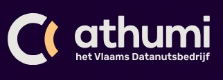

# Digitale-aangifte-overlijden-demo
**Let op:** 'DAO' is de tijdelijke projectcodenaam die tot nu toe is gebruikt. In de toekomst zal worden overgeschakeld naar 'eLys', de officiële naam van het platform. Zorg er daarom voor dat er geen hardcoded configuratie op deze projectcodenaam wordt toegepast.

Met deze demoapp zouden wij graag demonstreren hoe het mogelijk is om met ons platform te integreren.
Deze demo app kan gebruikt worden voor de verschillende integratoren die het systeem kent. 

Voor meer informatie rond de integratie als **Lokaal bestuur** kan je navigeren naar: [Startpunt burgerlijke stand](burgerlijke-stand/doc/README.md)

Voor meer informatie rond de integratie als **Arts** kan je navigeren naar: [Startpunt arts](vaststelling/doc/README.md)

