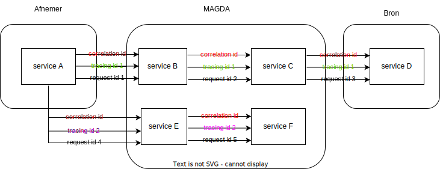

# OAuth 2.0 Client Authenticatie
Het eLys platform gebruikt het OAuth 2.0 protocol voor authorisatie met het Vlaams Toegangsbeheer als IDP.
Indien het OAuth 2.0 protocol niet gekend is, geeft 
[Authenticatie vlaanderen](https://authenticatie.vlaanderen.be/docs/beveiligen-van-toepassingen/integratie-methoden/oauth/) 
een duidelijk overzicht van het gebruikte protocol.

Voor het aanvragen van een Client voor zowel de beta, acceptatie als productie kan je [deze beschrijving volgen.](client-aanvragen.md)

## Gebruik van de api
Om onze rest api aan te spreken dient er een access token meegegeven te worden in de vorm van Bearer Authentication.
Om deze token aan te vragen, die uiteraard aangeleverd vanuit het Vlaams Toegansbeheer, kan je de [documentatie van de Vlaamse Overheid](https://authenticatie.vlaanderen.be/docs/beveiligen-van-api/oauth-rest/) volgen.

### Scopes
Voor het correct gebruik van onze applicatie moet er tijdens het aanvragen van de access token ook de juiste scopes meegeleverd worden.
Doordat er maar een beperkte set van API endpoints beschikbaar is, en deze per doelgroep geklusterd zijn, hebben we besloten om de scopes role based te maken.
Dit heeft als voordeel dat het, zowel tijdens het aanvragen van de client of access token, duidelijk is welke scopes er voor de gevraagde doelgroep nodig zijn.  

| Scope                  | Beschrijving                                                                                                                                                                                                   |
|------------------------|----------------------------------------------------------------------------------------------------------------------------------------------------------------------------------------------------------------| 
| vo_info                | Deze scope zorgt ervoor dat het eLys platform de vo_info claims ontvangen tijdens de introspectie van het acces token. Dankzij deze claims zijn wij in staat om te differentiëren welke actor de actie uitvoert. |
| elys_uitvaartondernemer | Deze scope dient gebruikt te worden voor een actor binnen de Uitvaart sector.                                                                                                                                  |
| elys_crematorium        | Deze scope dient gebruikt te worden voor een crematorium.                                                                                                                                                      |
| elys_depzorg            | Deze scope dient gebruikt te worden voor het Departement zorg.                                                                                                                                                 |
| elys_lbbs               | Deze scope dient gebruikt te worden voor een lokaal bestuur wanneer zij het platform benaderen als dienst burgerlijke stand.                                                                                   |
| elys_begraafplaats      | Deze scope dient gebruikt te worden voor een lokaal bestuur wanneer zij het platform benaderen als verantwoordelijke voor de begraafplaats.                                                                    |
| elys_arts               | Deze scope dient gebruikt te worden voor een arts.                                                                                                                                                             |

Tijdens het aanvragen van de access token moet altijd zowel `vo_info` als een van de andere scopes worden meegegeven. 
Omdat we de vo_info gebruiken om op een veilige manier het onderscheid te maken tussen de verschillende actoren, is er de verwachting dat er per actor (bvb een Lokaal bestuur) een client wordt aangevraagd.

### Rollen beheer
Doordat er een client per bvb lokaal bestuur wordt gebruikt is het eLys platform verantwoordelijk voor de controle of de client toelating heeft tot het platform, en voor het correct afschermen van de gegevens tussen de verschillende lokale besturen. 
Echter, de controle of de gebruiker van de toepassing gelinkt is aan het lokaal bestuur en of de rol van de gebruiker correct is voor het eLys platform te gebruiken is de verantwoordelijkheid van de integrator.
Dit is een sterke verantwoordelijkheid die ook gepaard gaat met een verplichting tot een audit log.

Hetzelfde geldt voor de integratoren voor de overige actoren.

### Headers
Bij het sturen van een request wordt er verwacht dat er volgende headers aanwezig zijn:

| Header           | Beschrijving                                                                                                                                                   |
|------------------|----------------------------------------------------------------------------------------------------------------------------------------------------------------|
| Authorization    | De access token in de vorm `Bearer {{token}}`                                                                                                                  |
| x-correlation-id | Een uuid die wordt gebruikt om bij elkaar horende requesten te koppelen. Dit kunnen verschillende requesten zijn die gebruikt worden om 1 scherm op te vullen. |
| x-tracing-id     | Een uuid die wordt gebruikt om requesten die binnen dezelfde lokale transactie worden verstuurd te koppelen.                                                   |
| x-request-id     | Een uuid die per request uniek is.                                                                                                                             | 

Een voorbeeld vanuit MAGDA:

### Logging vereisten voor de integratoren
Aangezien integrators connecteren met de API van het eLys platform via een access token weet het platform niet welke gebruiker (dus welke persoon) acties uitvoert. 
Er kan in het eLys platform enkel gelogd worden welke organisatie er een actie doet. 
Het platform zal altijd loggen welke acties de client heeft uitgevoerd en dit telkens gecorreleerd op een of meerdere aangiftes. 
Omdat het eLys platform omgaat met gevoelige data, moeten de clients die gebruik maken van de API zelf een correcte audit logging voorzien. 
De verwachting is dat wanneer er gebruikers informatie gebruiken die afkomstig is vanuit het platform, of acties ondernemen met het platform, het mogelijk moet zijn om deze handelingen te koppelen met individuele gebruikers. 

Wanneer er een incident voorkomt kan het zijn dat er contact wordt opgenomen met beheerder van de client om deze informatie op te vragen.

Deze audit logs moeten bewaard worden gedurende 10 jaar, zoals ook beschreven in [bewaartermijnen](bewaartermijnen.md).

## Testen van de api
Om snel te controleren of alle acties correct zijn uitgevoerd is er een endpoint voorzien voor de security te testen:
- https://elys.api.beta-athumi.eu/health/v1/ping
- https://elys.api.acc-athumi.eu/health/v1/ping
- https://elys.api.athumi.eu/health/v1/ping

Per omgeving moet er een unieke client aangevraagd worden. 
