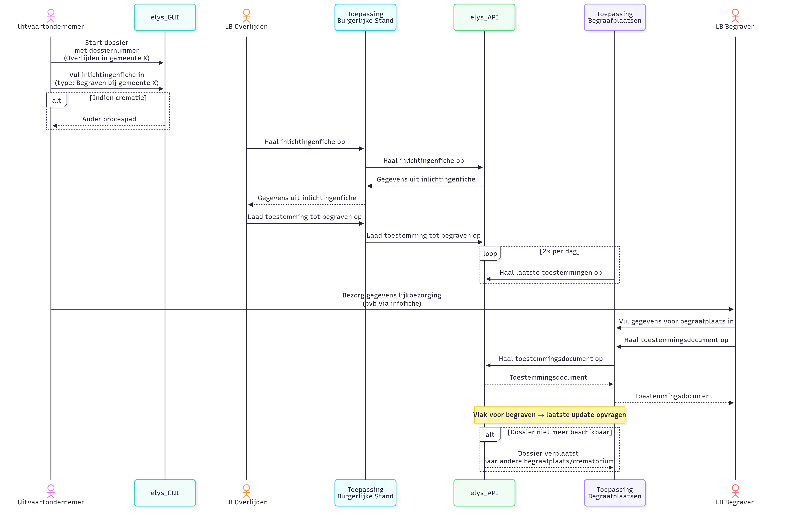
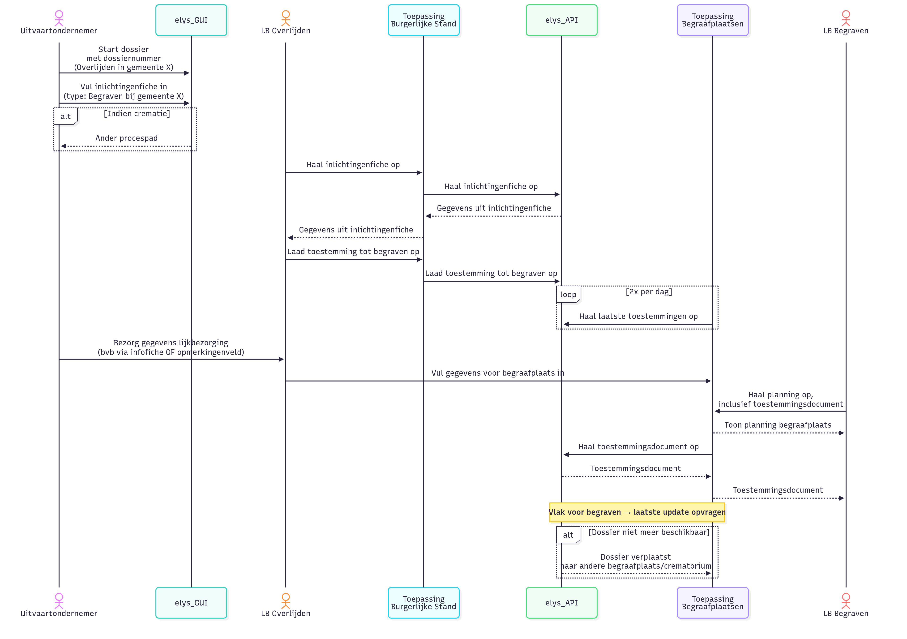

# Gebruik van de API van het eLys platform voor het krijgen van toestemmingen voor een gemeente van begraven

## Inleiding

Dit document legt uit hoe je de API van het eLys platform kunt gebruiken om toestemmingen te verkrijgen.
Voor meer info omtrent de toegang kan je [hier meer lezen](../../../algemeen/security/README.md)

## Endpoints

Alle endpoints starten altijd met: `/begraafplaats/v1`

### Toestemmingen ophalen
- **Endpoint**: `/toestemmingen`
- **Beschrijving**: Dit endpoint geeft de metadata en de link voor de documenten. Er zijn verschillende mogelijkheden om te zoeken op dit endpoint:
  - Op basis van een dossiernummer met de query parameter dossiernummer
  - Op basis van het rijksregisternummer met de query parameter rijksregisternummer
  - Op basis van een periode met wijzigingen met de parameters van=dateTime en tot=dateTime 

### Toestemmingsdocument ophalen
- **Endpoint**: `/toestemmingen/{dossiernummer}/toestemming`
- **Beschrijving**: Hiermee kan er een toestemmingsdocument gedownload worden 

## Voorbeeld gebruik
### Dienst burgerlijke stand is duidelijk gescheiden van dienst begraafplaatsen

### Dienst burgerlijke stand bereidt planning begraafplaatsen voor
#### Gemeente overlijden zelfde als gemeente begraven
Met manuele ingave van info lijkbezorging in toepassing begraafplaatsen

#### Gemeente overlijden is verschillende van gemeente begraven
TBC

## Swagger

De volledige documentatie van de API is beschikbaar via Swagger-UI. Deze is te vinden op:
- **Locatie**: `/swagger-ui/index.html`
- [**Beta**](https://elys.api.beta-athumi.eu/swagger-ui/index.html?urls.primaryName=Begraafplaats)
