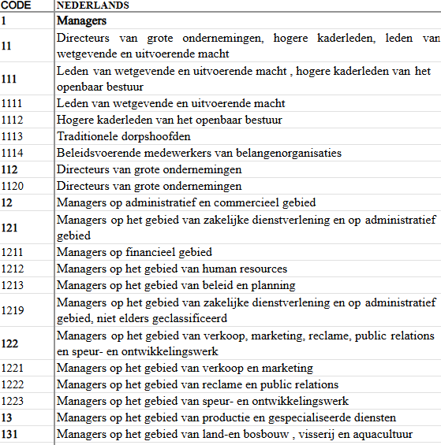

# FAQ

1. Er dient een nationale **overlijdensakte** én een uittreksel internationale overlijdensakte verstuurd te worden.  Moet dit functioneel best op hetzelfde moment verstuurd worden naar jullie want in theorie zou de ambtenaar, indien we er aparte acties van zouden maken, tussenin nog wijzigingen kunnen aanbrengen, waardoor beide documenten niet overeen komen. 

    - We volgen deze suggestie om dit in 1 actie te doen.  
      Opgelet: in praktijk is dit het ‘uittreksel overlijdensakte’ (niet het afschrift) en het ‘internationaal meertalig uittreksel overlijdensakte’: we kregen zelf feedback van de gemeenten dat de correcte terminologie moet gebruikt worden + in theorie zou ook het afschrift op vraag kunnen aangeboden worden, maar standaard wensen de gemeenten het uittreksel via het platform te verzenden.

2. Dienen wij het mogelijk te maken dat de ambtenaar **de akten meermaals kan bezorgen** en dus overschrijven bij jullie?

    - Een update is zeker nodig, er kan altijd een fout staan (bv. in het overlijdensuur).

3. Dienen we voor de faciliteitengemeenten ook gewoon alle documenten enkel in het Nederlands aan te leveren? In deze gemeenten beschikken de inwoners over de mogelijkheid om de documenten **ook in het Frans** afgeleverd te krijgen.  Zijn de documenten die wij aanleveren enkel bedoeld voor de begrafenisondernemers?  Dan lijkt het me voldoende dat we deze in het Nederlands aanleveren.

    - Is bedoeld voor de uitvaartondernemer, die het aan de nabestaanden bezorgt. Het is op dit moment niet voorzien dat er meer dan 1 versie van het uittreksel kan uitgewisseld worden. Op vraag van de nabestaanden kan rechtstreeks door de gemeente (buiten het platform) een FR versie bezorgd worden.

4. Een ambtenaar kan een **niet-gekoppeld verslag van een beëdigd arts verwijderen**.  Is het de bedoeling dat een ambtenaar dit zomaar kan?  Kan de ambtenaar hierover oordelen?  Of is dit enkel op vraag van een arts zelf?

    - De ambtenaar moet dit inderdaad zelf beoordelen, in praktijk natuurlijk in overleg met de beëdigd arts die bv. per ongeluk 2 verslagen heeft ingediend. 
    In de UX moet dit wel voldoende duidelijk gemaakt worden dat dit een onomkeerbare actie is en men dus absoluut zeker moet zijn.

5. "Als ABS wil ik een **foutief ingediende vaststelling door de arts kunnen verwijderen**, waardoor deze niet langer zichtbaar is voor de uitvaartondernemer en een nieuwe vaststelling voor hetzelfde rijksregisternummer kan ingediend worden." --> kan de ambtenaar hierover oordelen of het dossier/de aangifte verwijderd mag worden?

    - De ambtenaar moet dit inderdaad zelf beslissen, in praktijk kan dit enkel op vraag van de arts die heeft aangegeven dat hij een volledig foutieve vaststelling heeft gedaan (bv. heeft de ID-kaart van de passagier gebruikt die nog leeft). Dit is echt een edge case dus hier is het van essentieel belang dat dit niet zomaar kan gebeuren en men hier echt zeker over moet zijn. Idealiter kunnen ze hier ook een opmerking/document (bv. mail van de arts ter bevestiging) bijvoegen in hun dossier.

6. Ivm het duidelijk maken aan de ambtenaar dat er een dossier is met een **nieuwe/gewijzigde inlichtingenfiche** van de uitvaartondernemer: klopt het dat we van het platform gewoon steeds de laatste versie ontvangen en dat wij ervoor moeten zorgen dat we dit vergelijken met de info die we al hadden?  En dan de ambtenaar erop attent maken dat het gaat om een nieuwe/gewijzigde fiche?

    - Dat klopt, jullie moeten zelf de storage voorzien en de wijzigingsdatum vergelijken met de reeds gekende datum van de inlichtingenfiche. Opgelet: niet elke wijziging aan de inlichtingenfiche heeft impact op het eventueel reeds opgemaakte toestemmingsdocument (best dus laten interpreteren door ABS en laten aangeven dat de wijziging bekeken en afgehandeld werd) bv. wijziging begraafplaats. Bij doodgeboorte kan er ook een wijziging doorkomen in de gegeven voor akte levenloos kind (geen impact op toestemming, wel op akte).

7. Welke **socio-economische gegevens ontvangen we vs. kunnen we updaten**? 

    - Het principe is dat de data uit het Rijksregister getoond wordt, maar niet in het platform kan aangepast worden. Als de ABS een fout opmerkt moet hij in de bron zelf (RR) de data gaan aanpassen. Uitzondering is de woonsituatie/gezinstoestand, omdat dit vaak fout staat in RR is het wel mogelijk dat ABS dit in platfor aanpast. Ook de data uit de vaststelling wordt getoond maar is niet aanpasbaar.
    - Het is de bedoeling dat jullie met de GET een tabel gaan bouwen die er gelijkaardig uitziet als in de demo app. Als jullie de tabel opbouwen, hou rekening dat de socio-econ gegevens verschillen voor model IIIC (enkel overledene) en model IIID (gegevens ouders).
    - Enkel de beroeps en opleidingsgegevens en woonsituatie zijn aanpasbaar via de PUT. 

8. Wij kunnen zelf een **refresh doen van het rijksregister**, is de functionaliteit bij jullie nodig? 

    - Gezien de gegevens uit het RR niet kunnen geüpdatet worden in het platform zelf, is het dus na aanpassing in RR nodig dat de refresh functionaliteit in ons platform gebruikt wordt zodat de juiste info doorgaat naar DepZorg. 

9. Kan de uitvaartondernemer **statistische gegevens (blijvend) aanpassen**? 

    - Een uitvaartondernemer kan de socio-economische gegevens op gelijk welk moment invullen en ook updaten.
    - Heeft hij het nog niet gedaan en is de ABS verder wel klaar: dan kan het dossier gewoon afgesloten worden en gaat de data naar DepZorg door met 'onbekend'.
    - Vult de UO nadien de gegevens aan, zal het dossier automatisch heropenen bij het lokaal bestuur en wanneer de ABS het dossier opnieuw afsluit zullen de geüpdatete gegevens doorgaan naar Zorg. Dat gebeurt zo telkens als de UO een update doet.

10. Klopt het dat jullie controleren op **voorwaarden voor afsluiting dossier**? 

    - Klopt, jullie zullen een foutmelding krijgen wat ontbreekt in het dossier.
    - Als er gegevens moeten aangevuld worden (RRnr overleden, ouders, PV-nr), zal het inderdaad niet mogelijk zijn om een dossier af te sluiten. Maar het lijkt me wel nuttig om duidelijk te maken aan de gebruiker in welke gevallen dit verwacht wordt bv. RRnr vaststelling ontbreekt --> LB moet aanvullen, niet-natuurlijk overlijden --> PV-nr aanvullen of NVT aanduiden...

11. Indien een ambtenaar een niet-gekoppeld verslag aan een elys-dossier koppelt, kan hij/zij dit ook terug ontkoppelen. Kan ook **een verslag dat al onmiddellijk aan een eLys-dossier hangt ontkoppeld worden door de ambtenaar**? Of kan dit dus enkel voor een zelf gekoppeld verslag? 

    - Ja dat is zeker ook het geval. Stel dat bv. de beëdigd arts een foutief antwoord heeft gezet in het verslag en de gemeente opbelt, moet de gemeente het oorspronkelijke kunnen ontkoppelen en verwijderen (in die volgorde).
    - De id van het verslag om dit te kunnen loskoppelen kan opgehaald worden via de verslagDetailURL.

12. Welke **beroepenlijst** wordt gebruikt bij het beroep (voor de socio-economische gegevens)?

    - De beroepen zijn gebaseerd op de Internationale standaard beroepen classificatie ISCO-08. De volledige lijst kan bekeken worden via het document op [deze pagina](https://statbel.fgov.be/nl/over-statbel/methodologie/classificaties/internationale-standaard-beroepen-classificatie-isco-08#:~:text=Labour%20Organization%20(ILO).-,ISCO%2D08,(XLS%2C%20201.5%20Kb),-ISCO%2D08).
    - Er worden 2 velden meegedeeld: de ISCO-code (met 1, 2, 3 of 4 cijfers, afhankelijk van de mate van detail dat gekend is) en de beroepsomschrijving.  

    

13. Een woordje uitleg bij de **verslagen** horend bij een overlijdensdossier:

    - Verslag beëdigd arts: is steeds nodig in het geval van een *crematie* (voorwaarde om een toestemming tot crematie te mogen afleveren door de ABS!), maar vaak wordt het standaard gedaan vooraleer men de exacte keuze lijkbezorging weet.
    - Medisch verslag overlijden: dit is een onderdeel van de vaststelling (nl. de bezwaren (5), risico (1), maatregel (1)) en deze moeten *altijd* ingevuld worden (met ja of nee).  
    Dat wil zeggen als een van de 7 items ontbreekt het antwoord hierop ‘nee’ was.
    - Medisch attest zwangerschapsduur: bij elke *doodgeboorte* is de arts *verplicht* dit attest in te vullen.
    - Bijkomend medisch attest: is steeds nodig in het geval van een *crematie* (zelfde voorwaarde om een toestemming tot crematie te mogen afleveren als verslag beëdigd arts en beide antwoorden moeten in principe overeenstemmen, anders is er verdere contactname nodig door de ABS om uit te klaren waarom dit verschilt).  
    Dit wordt dus optioneel ingevuld door de vaststellende arts, hij kan dit overslaan, maar zal dit naar verwachting standaard invullen.
    