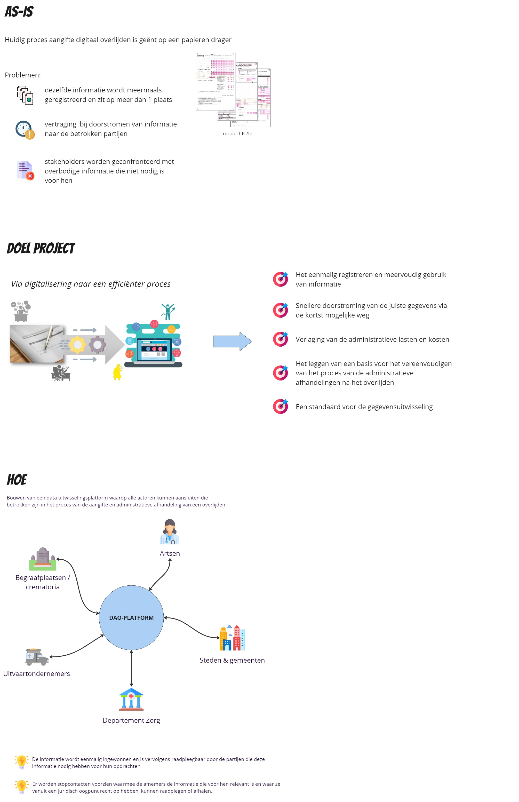
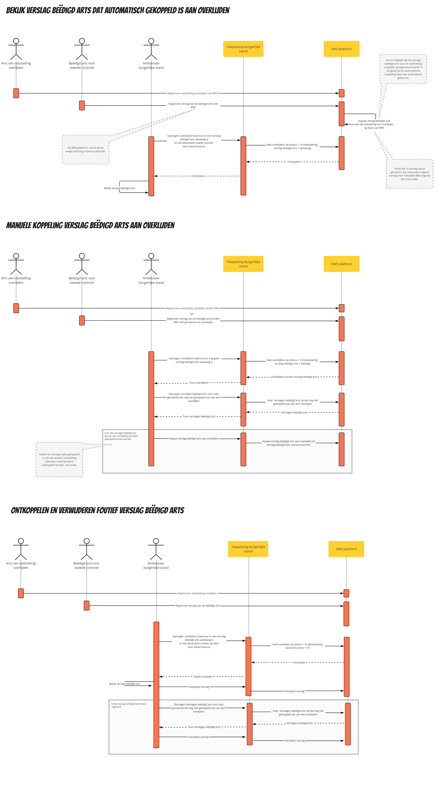
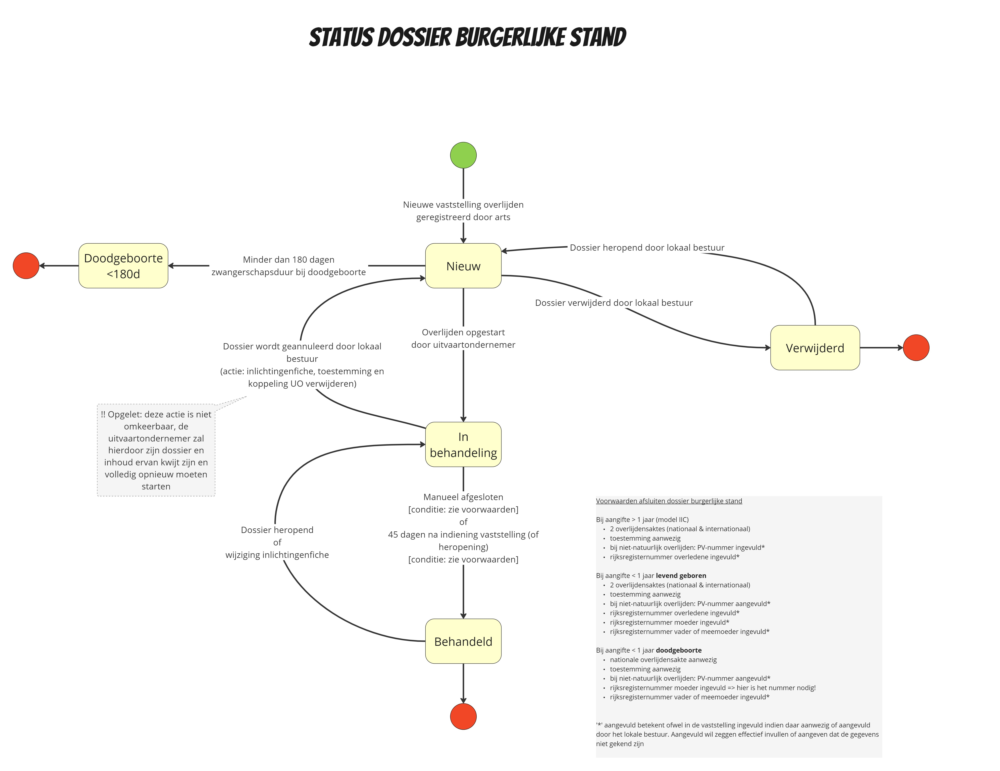
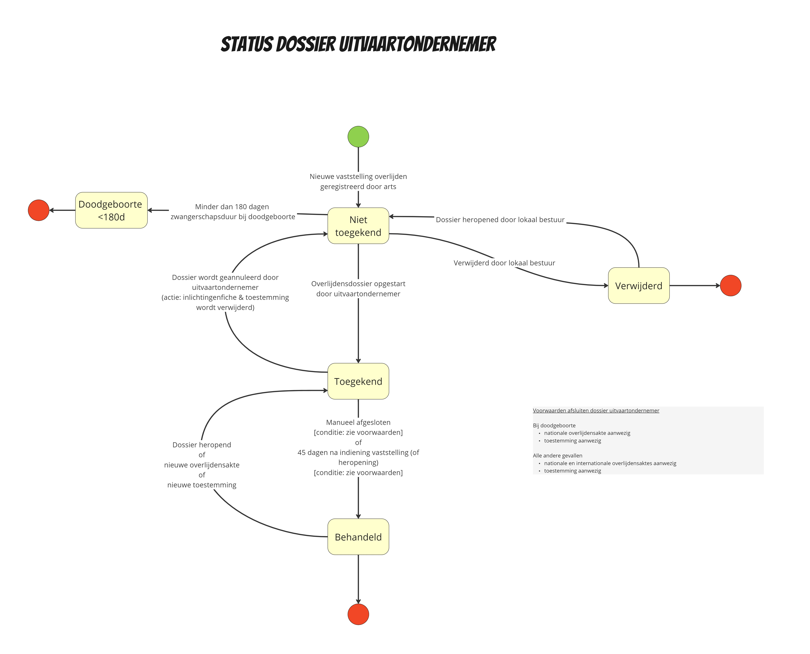
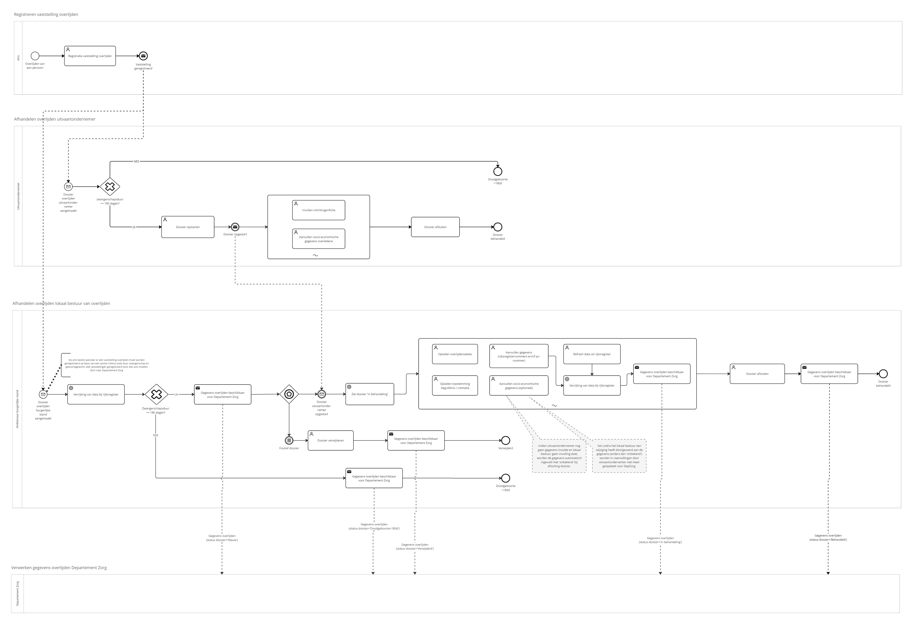
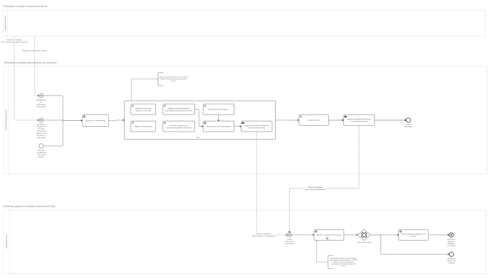

# Context toepassing burgerlijke stand

## Inleiding

Deze pagina bevat een aantal diagrammen die kunnen helpen om extra context te geven rond het DAO platform en specifiek het gebruik van de toepassing burgerlijke stand.

## Doel platform

## Betrokken partijen

Dit context diagram toont een overzicht van de verschillende actoren en toepassingen die interageren met het DAO platform.

## Toepassing burgerlijke stand

Hieronder vindt u sequentie of state diagrammen terug die de belangrijkste processen in de toepassing burgerlijke stand visualiseren.

### Afhandelen dossier

### Koppeling verslag beëdigd arts

### Dossier statussen

## Datadeling met Departement Zorg

Volgende diagrammen tonen onder andere op welke manier de toepassing burgerlijke stand invloed heeft op de datadeling met Departement Zorg.

### Gebruikelijke flow

### Heropenen dossier

