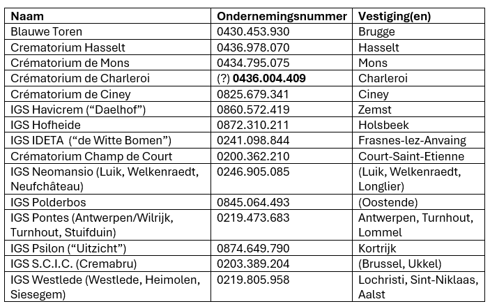

# Functionaliteit API crematoria

## Opvragen gegevens

### Voorgesteld gebruik

Onderstaande diagram visualiseert hoe de voorziene API gebruikt kan worden.

Hierbij worden volgende endpoints gebruikt:
- `/crematorium/v1/toestemmingen`, enkel met dossiernummer (niet van-tot)
- `/crematorium/v1/toestemmingen/{dossiernummer}/toestemming`

Naast deze flow is ook endpoint `/crematorium/v1/toestemmingen` met van-tot parameters voorzien.
Deze kan, indien gewenst, gebruikt worden om een lijst op te halen met toestemmingen voor het crematorium die werden afgeleverd binnen de van-tot periode.
Dit zou gebruikt kunnen worden om te valideren of voor elk van deze toestemmingen een reservatie werd ontvangen.

### Architectuur

- Scope: elys_crematorium
- Crematoria kunnen voor een overlijden gegevens opvragen vanaf dat er een toestemming tot crematie is aangevraagd, dus wanneer een inlichtingenfiche is ingevuld.
- De gegevens van een overlijden kunnen specifiek voor één overlijden worden opgevraagd
    - Op dossiernummer 
- Er kan ook een lijst met gegevens van verschillende overlijdens worden opgevraagd
    - ‘Van’ tijdstip + optioneel 'tot' tijdstip als parameters voorzien
    - Het tijdstip is het laatste (her)oplaadtijdstip van het **toestemmingsdocument**
    - Max 100 elementen + aanduiding of er nog meer overlijdens zijn die voldoen aan de opvraging (dus aantal > 100)

- Crematoria kunnen enkel gegevens opvragen die voor hen bestemd zijn
    - Er wordt een controle gedaan op basis van KBO-nummer - volgens indiening door uitvaartondernemer in inlichtingenfiche:

**Gebruikte lijst crematoria**

**(!) Belangrijk**: Crematoria moeten bevraging blijven herhalen. Toestemmingen kunnen namelijk vervallen (indien nieuwe inlichtingenfiche leidt tot een nieuwe toestemming die moet opgeladen worden door het lokaal bestuur).

### Voorbeeld opvragen van één overlijden

### Voorbeeld opvragen lijst van overlijdens

**Gegeven** dat onderstaande overlijdens geregistreerd zijn in het eLys-platform voor crematorium Blauwe Toren:

**wanneer** crematorium Blauwe Toren de toestemmingen opvraagt tussen 10/01/2025 10u en 10/01/2025 13u

**dan** worden volgende overlijdens wel of niet terug gegeven

## Welke gegevens

- het toestemmingsdocument voor de begrafenis / crematie
- gestructureerde informatie beschikbaar in het platform

