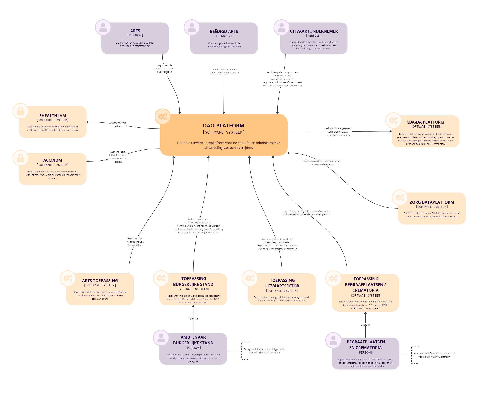

# Context uitvaartondernemer

## Inleiding

Deze pagina bevat een aantal diagrammen die kunnen helpen om extra context te geven rond het eLys platform en specifiek het gebruik van de toepassing voor de uitvaartondernemer.

## Doel platform

## Betrokken partijen

Dit context diagram toont een overzicht van de verschillende actoren en toepassingen die interageren met het eLys platform.

## Toepassing voor de uitvaartondernemer

Hieronder vindt u sequentie of state diagrammen terug die de belangrijkste processen in de toepassing voor de uitvaartondernemer visualiseren.

### Afhandelen dossier

### Dossier statussen

