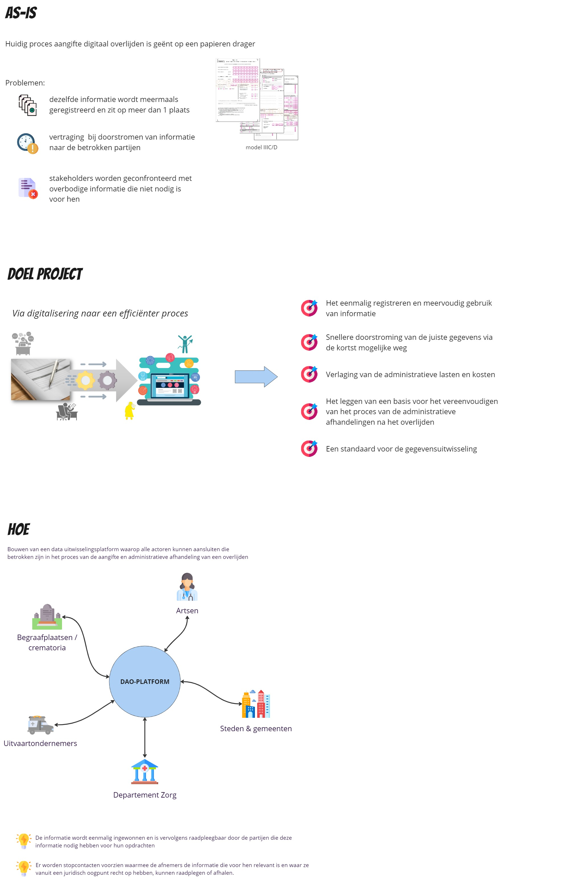
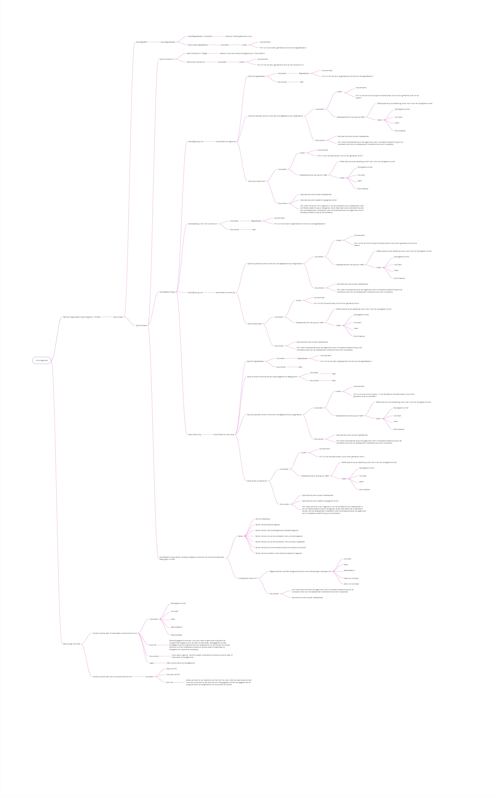
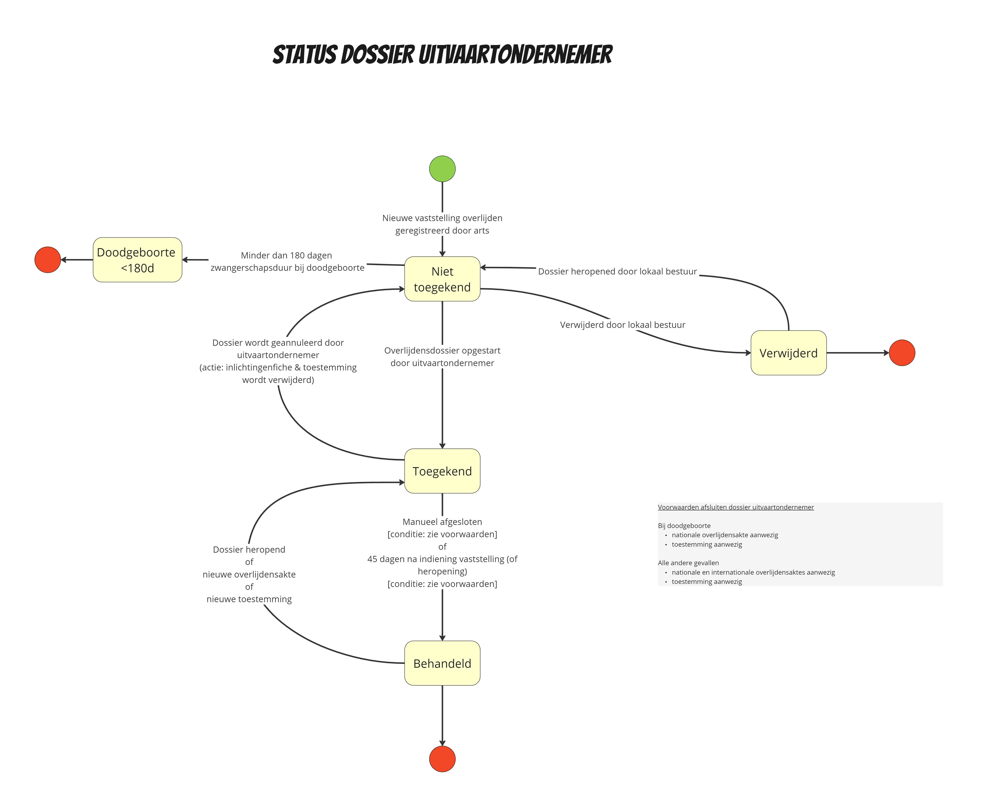

# Context uitvaartondernemer

## Inleiding

Deze pagina bevat een aantal diagrammen die kunnen helpen om extra context te geven rond het eLys platform en specifiek het gebruik van de toepassing voor de uitvaartondernemer.

## Doel platform

## Betrokken partijen

Dit context diagram toont een overzicht van de verschillende actoren en toepassingen die interageren met het eLys platform.

## Toepassing voor de uitvaartondernemer

Hieronder vindt u een aantal diagrammen terug die de belangrijkste processen in de toepassing voor de uitvaartondernemer visualiseren.

### Afhandelen dossier

Onderstaande sequentie diagram visualiseert hoe een uitvaartondernemer een dossier afhandelt in de eLys web applicatie. 
Dit kan gebruikt worden als leidraad voor de eigen toepassing.

### Invullen inlichtingenfiche

Onderstaande beslissingsboom toont hoe de verschillende keuzen in de inlichtingenfiche zijn opgebouwd in de eLys web applicatie.

### Dossier statussen

Een dossier kan bij de uitvaart volgende statussen doorlopen.

Ter info, het dossier doorloopt aparte statussen bij het lokaal bestuur:

